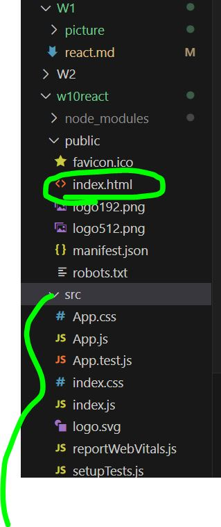

# react

1. 開始 react 專案(資料夾名稱必須是小寫)
```
npx create-react-app yourfoldername
```
自動蒐集所需套件

[node 與 npm 有版本關係要注意](https://nodejs.org/zh-tw/about/previous-releases)

1.5. 把node＿module抓回來
```
npm install
```

2. 前往react 專案目錄
```
cd 資料夾名稱
```

3. 開啟(在react所在的資料夾中)
```
npm start
```


## react基本介紹
.gitignore 標記著哪一些檔案不會上傳到github上，如一些很大的檔案
exempli gratia : **node_module**


***gitignore標註的檔案由於它不會上傳，因此你在家時必須使用" npm install" 安裝***
```
npm install
```
### 程式寫在src底下，HTML在public中


index.html: 主 HTML 文件
index.js: 應用程式的入口文件，負責渲染 React 組件(App.js)到 index.html 的root 中。
App.js: 主 React 組件，我們通常在這寫程式。

### function 字首大寫
###  class => className  駝峰命名法（camelCase）
 app.js


## 在react 中使用SCSS 
    進入react 專案的資料夾，並安裝SASS 在node_module中
    ```
    cd react_floder
    npm install sass
    ```
    